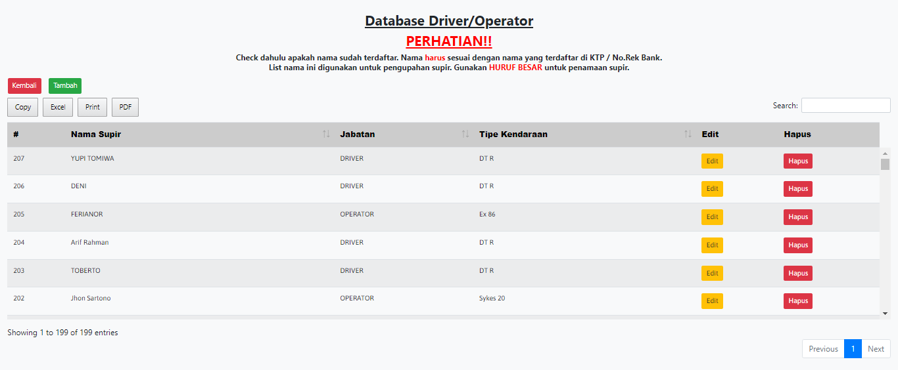
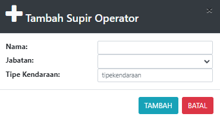

# Driver/Operator

### DATABASE DRIVER/OPERATOR

Tabel ini menginformasikan list supir dan operator yang terdaftar. List ini digunakan unutk pengupahan supir/operator

Tabel ini bisa menambah, mengedit dan menghapus data supir&#x20;

### Tambah Supir

Form ini untuk menambah kan supir baru. Check dahulu apakah nama sudah terdaftar. Nama harus sesuai dengan nama yang terdaftar di KTP / No.Rek Bank. List nama ini digunakan untuk pengupahan supir. Gunakan HURUF BESAR untuk penamaan supir

* Nama : Masukan Nama supir atau operator (harus huruf besar)&#x20;
* Jabatan : Jabatan orang baru (Supir dan Operator)&#x20;
* Tipe Kendaraan : Tipe kendaraan yang digunakan supir

### Edit/Rubah Database

Form ini digunakan ketikan data supir atau operator mengalami kesalahan data.&#x20;

* Nama : Masukan Nama supir atau operator (harus huruf besar)&#x20;
* Jabatan : Jabatan orang baru (Supir dan Operator)&#x20;
* Tipe Kendaraan : Tipe kendaraan yang digunakan supiR
