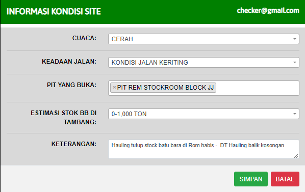

# Informasi Kondisi Lapangan

### INFORMASI KONDISI LAPANGAN

Form ini menginformasikan keadaan yang sedang terjadi ditambang. Form diisi berskala 1 jam atau ketika cuaca sudah mulai berubah

* Cuaca : Informasikan cuaca yang sedang terjadi di area tambang (Masukan dengan list yang telah disediakan)
* Keadaan Jalan : Informasikan keadaan jalan di area tambang (Masukan dengan list yang telah disediakan)
* PIT Yang Buka : Informasukan semua PIT yang masih terbuka / melakukan aktivitas
* ESTIMASI STOK DITAMBANG : Informasikan perkiraan tonase batubara ditambang (Masukan dengan list yang telah disediakan)
* KETERANGAN : Masukan keterangan informasi kondisi lapangan yang sedang terjadi ditambang
